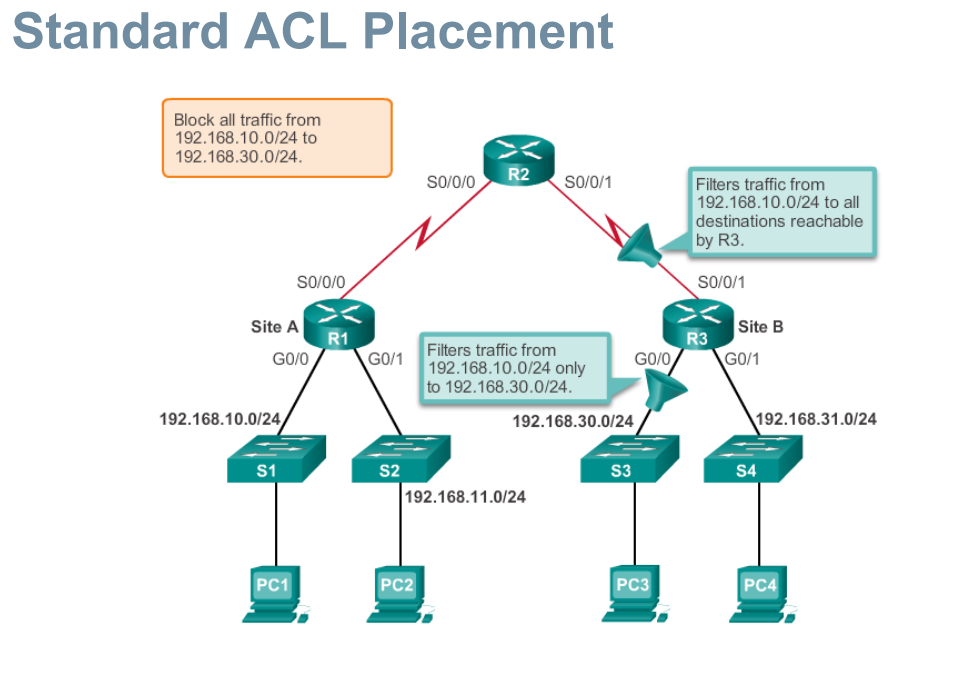
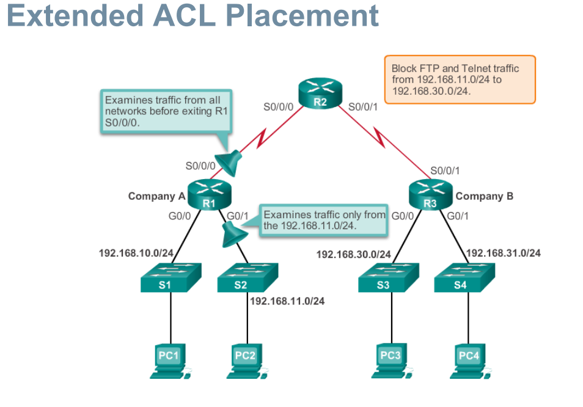
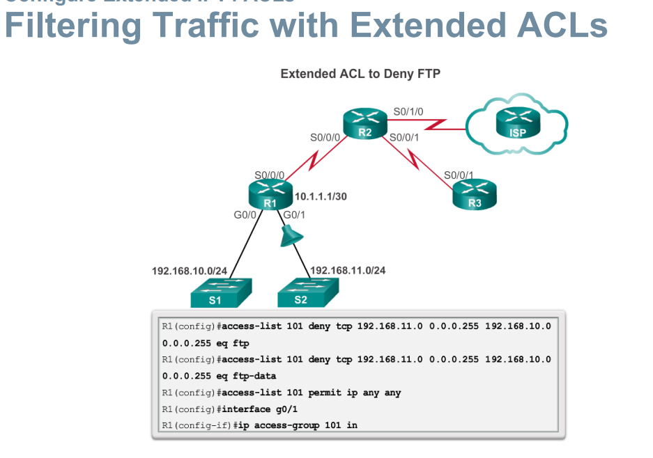

# Access Control Lists
- Packet filtering, sometimes called static packet filtering, controls access to a network by analyzing the incoming and outgoing packets and passing or dropping them based on given criteria, such as the source IP address, destination IP addresses, and the protocol carried within the packet.
- A router acts as a packet filter when it forwards or denies packets according to filtering rules.
- An ACL is a sequential list of permit or deny statements, known as access control entries (ACEs).
- The last statement of an ACL is always an implicit deny.
- This statement is automatically inserted at the end of each ACL even though it is not physically present. The implicit deny blocks all traffic. Because of this implicit deny, an ACL that does not have at least one permit statement will block all traffic.

## General Guidelines for Creating ACLs (cont.)
- One ACL per protocol - To control traffic flow on an interface, an ACL must be defined for each protocol enabled on the interface.
- One ACL per direction - ACLs control traffic in one direction at a time on an interface. Two separate ACLs must be created to control inbound and outbound traffic.
- One ACL per interface - ACLs control traffic for an interface, for example, GigabitEthernet 0/0

## Where to Place ACLs
**Every ACL should be placed where it has the greatest impact on efficiency. The basic rules are:**
- Extended ACLs - Locate extended ACLs as close as possible to the source of the traffic to be filtered.
- Standard ACLs - Because standard ACLs do not specify destination addresses, place them as close to the destination as possible.

<br>
<br>

## Standard ACL
`Router(config)# access-list access-list-number deny permit remark source [ source-wildcard ] [ log ]`<br>
To remove the ACL, the global configuration `no access-list` command is used.
**examples**
```
access-list 2 deny host 192.168.10.10
access-list 2 permit 192.168.10.0 0.0.0.255
access-list 2 deny 192.168.0.0 0.0.255.255
access-list 2 permit 192.0.0.0 0.255.255.255
```

**Cisco IOS applies an internal logic when accepting and processing standard access list statements. As discussed previously, access list statements are processed  equentially. Therefore, the order in which statements are entered is important.**<br>

### After a standard ACL is configured, it is linked to an interface using the ip access-group command in interface configuration mode:
`Router(config-if)# ip access-group { access-list-number | access-list-name } { in | out }`<br>
To remove an ACL from an interface, first enter the `no ip access-group` command on the interface, and then enter the global `no access-list` command to remove the entire ACL.

## Extended ACL
The procedural steps for configuring extended ACLs are the same as for standard ACLs. The extended ACL is first configured, and then it is activated on an interface. However, the command syntax and parameters are more complex to support the additional features provided by extended ACLs.

`access-list access-list-number {deny | permit | remark} protocol source [source-wildcard] [operator operand] [port port-number or name] destination [destination-wildcard] [operator operand] [port port-number or name] [established]`

<br>