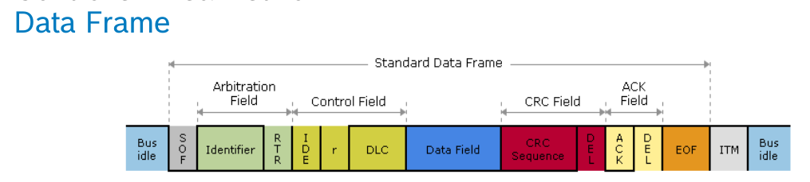
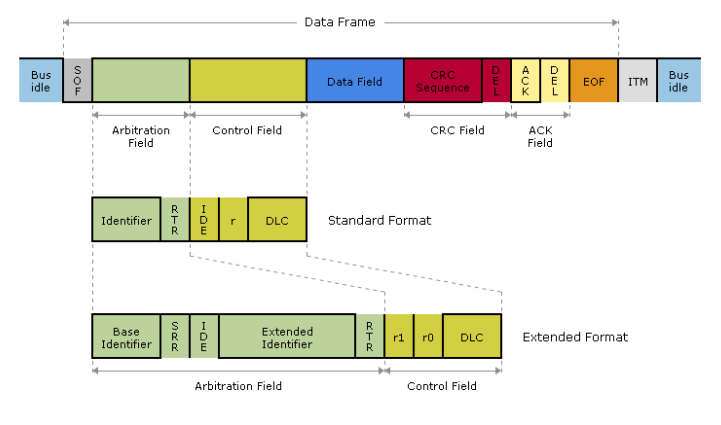
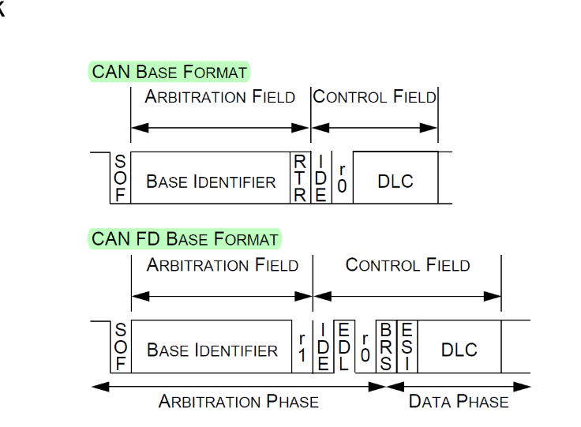

# Security of Automotive networks
- What’s the difference between safety and security?
    - Safety: protection from harm or other non-desirable outcomes, caused by non-intentional failure or human error
        - Protection from accidents
    - Security: protection from harm or other non-desirable outcomes caused by intentional human actions or human behavior
        - Protection from attacks
- What are the properties of the CIA & AAA model?
    - Confidentiality
    - Integrity
    - Availability
    - Authentication
    - Authorization
    - Accounting / non-repudiation    
- What are the properties of the STRIDE model?
    - Spoofing
    - Tampering
    - Repudiation
    - Information disclosure
    - Denial of service
    - Elevation of privilege
- What are the motivations of an attacker in the automotive industry?
    - cause harm, challenge, curiosity, fun, spying, hacktivism, prestige, revenge, theft, futher malicious activities, etc.
    - terrorism, ransomware/theft, (self-)tuning, 
- What are the common attack vectors in a vehicle?
    - External connectivity interfaces (GSM, WiFi, Bluetooth, GPS)
    - Sensor fooling
    - Physical access
    - Human factor
- What protocols are used commonly in an in-vehicle network?
    - CAN, LIN, FlexRay, Ethernet
- What’s the difference between regular (TX) and automotive (T1) Ethernet?
    - 100Base-T1 (100Mbps) / 1000Base-T1 (1Gbps)
    - Meets the requirements of in-vehicle application
- What are the advantages of the Zonal Architecture?
	- Determines connectivity by physical location rather than function
	- Reduces the number of ECUs, removes ~1km of harness cabling
	- Decouples hardware and software, providing a service-oriented architecture (SOA)
- How does (high-speed) CAN operate on the physical layer?
	- Linear bus terminated at each end with 120 Ω resistors
	- Max. 1 Mbps
	- 2 wires: CAN High (CANH), CAN Low (CANL)
	- Two signal states (differential signaling)
		- Dominant („0”): CANH is driven towards 3.5V, CANL is driven towards 1.5V
			- the signals are „pulled” away from each other (differential voltage is a nominal ~2V)
		- Recessive („1”): CANH and CANL are returned to recessive state
			- with a nominal differential voltage of 0V
- How does a Standard CAN Data Frame look like?
	- Identifier (Address): 11 bit
	- Data Field: max. 8 bytes
	- 
- How does an Extended CAN Data Frame look like?
	- Identifier (Address): 29 bits
		- Base Address: 11 bits
		- Extension: 18 bits
		- 
- What’s the difference between a CAN and a CAN-FD Frame?
	- „Flexible Datarate”
	- Increased Data Field
		- Max. 64 bytes
	- Normal or Extended Address
	- Additional bits in the Header
		- IDE: Ideintifier Extension
		- EDL: Extended Data Lenght
		- BRS: Bit Rate Switch
		- ESI: Error State Indicator
		- 
- How does the arbitration work regarding CAN?
	- Carrier-Sense Multiple Access with Collision Avoidance (CSMA/CD)
	- All nodes must wait for an idle bus condition (before beginning to transmit a frame)
	- If two nodes begin to transmit a frame simultaneously, then they participate in a bitwise bus arbitration process
		- Wired-AND Logic
	- The node with the lowest ID wins the arbitration and continues to transmit its message
	- The other nodes lose the arbitration, back off and try later	
- What does it mean that “CAN was designed without security in mind”?
	- We can see all frames on the bus
	- We don’t know which node transmitted a given frame
	- We don’t know if the frame was altered on the bus or not
	- We are „free” to transmit arbitrary frames on the bus
- How would you perform a Denial-of-Service attack on a CAN bus?
	- The attacker sends high priority frames with a high speed (e.g., ID = 0x00)
	- The other nodes will not have a chance to win arbitration
- What common attacks can an attacker perform on a CAN network?
	- inject frames
	- manipulate frames
	- replay frames
	- ddos the bus
	- Drive a node to a „bus off” state
	- Spoof frames
- What measures do AUTOSAR E2E (End-to-End) Protection Profiles provide?
	- Provides a mechanism between the communicating nodes to detect communication erros
	- Using CRC algorithms and counters
- What measures do AUTOSAR SecOC provide?
	- Provides a mechanism between the communicating nodes to transmit data securely
	- PDU (Protocol Data Unit) Integrity + Authenticity: MAC or Signature
	- PDU Freshness: Protection against replay attacks with counter or freshness value
- Where would you place firewalls on a CAN bus?
	- Between segments on gateways
	- Between interfaces and the bus
- What tools would you use to monitor/analyze a CAN network?
	- Vector CANoe

---

# Applied Cryptography
- What do the letters of CIA-AAA mean (in case of cybersecurity)?
    - Confidentiality
    - Integrity
    - Availability
    - Authentication
    - Authorization
    - Accounting / non-repudiation
- Name a cryptographic solution to protect the Confidentiality property of CIA-AAA!
    - encryption
- Name a cryptographic solution to protect the Integrity property of CIA-AAA!
    - digital signature
- Name a cryptographic solution to protect the Availability property of CIA-AAA!
    - monitoring, redundancy
- Name a cryptographic solution to protect the Authentication property of CIA-AAA!
    - what you know/have/are
- Name a cryptographic solution to protect the Authorization property of CIA-AAA!
    - ID/role/attribute-based encryption
- Name a cryptographic solution to protect the Non-repudiation property of CIA-AAA!
    - digital signatures
- What does plaintext / cyphertext mean?
    - plaintext: the message in unencrypted form
    - cyphertext: : the message in encrypted/hidden form
- What does encryption / decryption mean?
    - the process of making the message unreadable to third parties. Plaintext -> ciphertext
    - the process of making an unreadable message readable. Ciphertext -> plaintext
- What does perfect secrecy mean?
    - information-theoretic security, unconditional security - the ciphertext conveys absolutely no information about the content of the plaintext (no practical solution, key must be as long as message)
- What does computational security mean?
    - it is not feasible to compute the plaintext from the ciphertext without the key. There does not exist any computationally secure encryption scheme that is surely secure. 
- What is the difference between symmetric and asymmetric encryption?
    - Symmetric is much faster
    - symmetric: same key used to encrypt and decrypt
    - asymmetric: different keys to encyrpt (public key) and to decrypt (private key)
- What does SMC mean, and how does it work?
    - Secure Multi-party Computation (SMC): an operation (typically: decryption) is only possible with the collaboration of several parties.
    - 𝑘 out of 𝑛 schemes: 𝑘 out of the 𝑛 participants are needed to apply the operation
- How does role/attribute/identity-based encryption work?
    - Role-based: ciphertexts can be decrypted by users in the required roles
    - Attribute-based: ciphertexts can be decrypted by users with the required attributes
    - Identity-based: a user’s public key can be anything unique to that user, its secret key pair is generated by a Trusted authority
- How does functional encryption work?
    - Functional: a secret key allows you to decipher a function of original plaintext. (Incredibly slow)
- What does homomorphic encryption mean?
    - Homomorphic: you can perform operations on the ciphertext without decrypting it.
- Why is it impossible to design cybersecurity-futureproof systems?
    - Crypto algorithms getting broken
    - Implementation / software vulnerabilities get known
    - Computers become much faster
    - Quantum computers begin working (they are over 100 qbits now!)
- What are the most important aspects of key management?
    - Responsibilities
    - How to store keys, passwords (hash, salt, encrypt)
    - Choose the parameters: Key size
    - Remember randomness! (“true random” seed / initial value; no copy)
- What does a HSM do?
    - Hardware Security Module
    - Certified
    - Manages keys (generate, store, delete, update …)
    - Performs encryption, decryption, strong authentication, digital signature, hashing, authorization, ...
    - Storage + chips
    - Sensitive data
    - Logical and physical protection!
    - Crypto accelerator (not quite like hw-only solutions but significant cpu offload)
- What does AUTOSAR CSM provide?
    - Cryptographic Service Manager [A modul in AUTomotive Open System Architecture (AUTOSAR)]
    - No access protection, just basic crypto services for all sw modules.
    - Abstraction layer to provide a standardized interface for higher sw layers.

---

# Cybersecurity management
- Which ISO standard deals with cybersecurity engineering?
	- ISO/SAE 21434
- Which lifecycle phases apply for cybersecurity risk management?
	- concept
	- product development
	- production
	- operations
	- maintenance
- What does the organizational cybersecurity management deal with?
	- Cybersecurity governance
	- Cybersecurity culture
	- Information sharing
	- Management systems
	- Tool management
	- Information security management
	- Organizational cybersecurity audit
- What does the project dependent cybersecurity management deal with?
	- Cybersecurity responsibilities
	- Cybersecurity planning
	- Tailoring
	- Reuse
	- Component out-of-context
	- Off-the-shelf component
	- Cybersecurity case
	- Cybersecurity assessment
	- Release for post-development
- What does the distributed cybersecurity activities deal with?
	- Supplier capability
	- Request for quotation
	- Alignment of responsibilities
- What does the continual cybersecurity activities deal with?
	- Cybersecurity monitoring
	- Cybersecurity event evaluation
	- Vulnerability analysis
	- Vulnerability management
- What do we do in the concept phase of risk management?
	1. Define the item, its operational environment and their interactions in the context of cybersecurity
	2. Specify cybersecurity goals and cybersecurity claims
	3. Specify the cybersecurity concept to achieve cybersecurity goals
- What do we do in the product development phase of risk management?
	- Define cybersecurity specifications
	- Verify that the defined cybersecurity specifications conform to the cybersecurity specifications from higher levels of architectural abstraction
	- Identify weaknesses in the component
	- Provide evidence that the results of the implementation and integration of components conform to the cybersecurity specifications.
- What do we do in the cybersecurity validation phase of risk management?
	- Validate the cybersecurity goals and cybersecurity claims
	- Confirm the item achieves the cybersecurity goals
	- Confirm that no unreasonable risks remain
- What do we do in post-development phases of risk management?
	- Apply the cybersecurity requirements for post-development
	- Prevent the introduction of vulnerabilities during production
	- Determine and implement remedial actions for cybersecurity incidents
	- Maintain cybersecurity during and after updates to items or components after production until their end of cybersecurity support.
	- Communicate the end of cybersecurity support
	- Enable decommissioning of items and components with regard to cybersecurity.
- What does TARA mean?
	-  threat analysis and risk assessment
- What steps do we follow when performing a TARA?
	- Identify assets, their cybersecurity properties and their damage scenarios
	- Identify threat scenarios
	- Determine the impact rating of damage scenarios
	- Identify the attack paths that realize threat scenarios
	- Determine the ease with which attack paths can be exploited
	- Determine the risk values of threat scenarios
	- Select appropriate risk treatment options for threat scenarios
		- risk value determination
		- risk treatment decision
- What does an asset mean?
	- Asset is what we protect
- What is a damage scenario?
	- Damage scenario is the worst case which can happen
- What impact categories and impact ratings do we use when assessing damage scenarios?
	- Impact categories:
		- safety
		- financial
		- operational
		- privacy
	- Impact ratings:
		- Severe
		- Major
		- Moderate
		- Negligible
- What ratings do we use when determining the feasibility of an attack?
	- High: The attack path can be accomplished utilizing low effort.
	- Medium: The attack path can be accomplished utilizing medium effort.
	- Low: The attack path can be accomplished utilizing high effort.
	- Very low: The attack path can be accomplished utilizing very high effort.
- What can we do to treat a risk?
	- Avoiding, Reducing, Sharing, Retaining

---

# Social engineering and DFIR
- What’s the definition (term) of social engineering?
	- Social engineering is the psychological manipulation of people into performing actions or divulging confidential information. 
- Who’s a social engineer (actor)?
	- A person who uses deception to manipulate individuals into divulging confidential or personal information that may be used for fraudulent purposes.
- What are the attack steps of social engineering?
	- OSINT
	- Profiling
	- Pretexting
	- Building rapport
	- Influencing
	- Framing
	- (Practicing)
	- Human hacking
- What does OSINT mean?
	- Open-source intelligence is the collection and analysis of data gathered from open sources
- What is an OSINT Framework?
	- Collection of tools used for OSINT
- What does profiling mean?
	- Learn to read people and then learn how to apply your profile and style to make communication easier
- What does pretexting mean?
	- Becoming anyone, you want (/have) to be
		- Make a plan based on OSINT
		- Define your goal and your personality
		- Practice remembering to the details
		- Look and act like the person you want to be
		- Execute the pretext
- What does building a rapport mean?
	- „Building rapport is like building a bridge for communication based on trust and common interests.” (Christopher Hadnagy)
- List influence principles with meanings or examples!
	- Reciprocity – you gave me sth and because of that I feel that I have to give sth in charge
	- Obligation – I have to give/provide you sth because of social norms and expected behaviours – THE BOX
	- Concession – admitting or agreeing that sth is true after first denying or resisting it
	- Scarcity – marketing tips and tricks: thinking that sth is very special, very unique
	- Authority – thinking that the other people is „superior” and because of this trust them
- What does framing mean?
	- Framing is a feature of how our brain works: the mind react to the context and not to the thing itself.
		- We kill our pet
		- We put our pet to sleep
			- Each sentence means the same thing, but our brain has framed the context to help us deal with a painful circumstance.
- What prevention techniques can a company use against social engineering attacks?
	- Learn to identify Social Engineering attacks
	- Develop actionable and realistic policies
	- Perform regular real-world checkups
	- Implement applicable security-awareness programs

## DFIR

- What are the main parts of digital forensic investigations?
	- Analysis
	- Recovery
	- Examination
	- Investigation
- What's the difference between live and dead forensic investigation?
	- live: analysing a running system
	- dead: investigating a turn off system -> eg. hard drive/SSD/flash drive/USB drive/etc.
- What does a forensic report contain (main parts)?
	- Executive summary
	- Objectives
	- Computer evidence analyzed
	- Relevant findings
	- Supporting details
	- Investigative leads
	- Additional subsections
		- Attacker methodology
		- User applications
		- Internet activity
		- Recommendations
- What is an adware/worm/rootkit/RAT/ransomware?
	- Adware - causes unwanted advertisements on the device
	- Worm - spreads from infected devices to other devices
	- Rootkit - disguises itself by providing to a high level of authority on the device
	- RAT - Remote Access Trojan, provides full control over the device
	- Ransomware – demands ransom from people by encrypting and exfiltrating files on the device
- What's the difference between static and dynamic malware analysis?
	- Static: analyzing malicious software by reverse engineering methods without running them Information examined: exported/imported DLL’s, CPU instructions, PE headers, strings in binary
	- Dynamic: examining the behavior of malicious software on the system by running it Information examined: network connections, file events, registry events, process events
- What are the six W’s of automotive forensics?
	-  Who, Why, Where, When, What, and hoW
- What vehicle parts could be targets to automotive forensics?
	- Automotive forensic targets can be the vehicle’s:
		- ECU
		- GPS
		- Key
		- Crash data
		- CAN