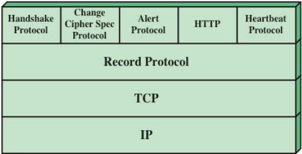
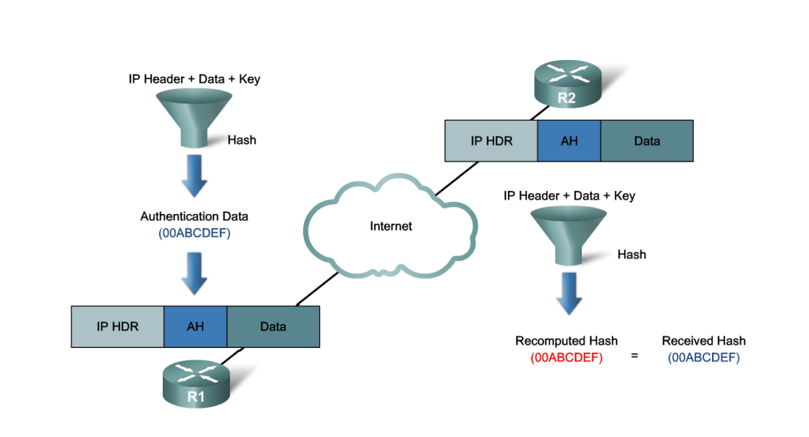
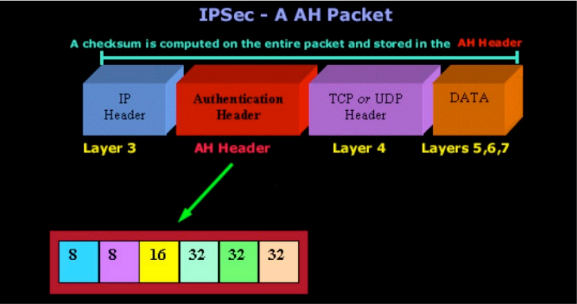
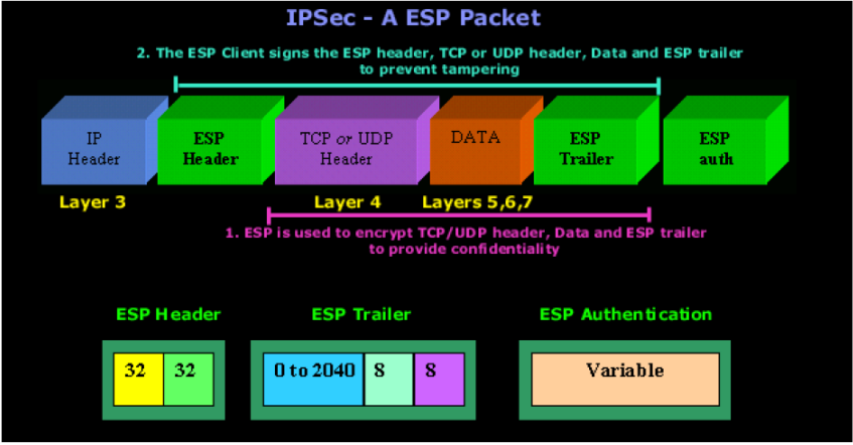

# SSL/TLS
## TLS can be viewed as SSL v3.1 and compatible with SSL v3

- biztonságos és megbízható végpontok közötti adatátvitel

## SSL is two-layers of protocols:
 

### Two SSL concepts
- SSL session:
    - kliens-szerver közötti kapcsolat;
    - a Handshake protokoll által létrehozott kriptográfiai paraméterek készletét határozza meg;
    - több SSL-kapcsolat is megoszthatja.
- SSL connection:
    - átmeneti, egyenrangú (peer-to-peer), biztonságos kommunikációs kapcsolat;
    - egy SSL-munkamenethez kapcsolódik (abból származik);
    - egy munkamenet többször is használható kapcsolatok létrehozására.
- A session-öket arra használják, hogy elkerüljék a költséges kriptó paraméter egyeztetéseket minden egyes connection-höz

## Session state parameters (Munkamenet állapot paraméterei)
- Session identifier - munkamenet azonosító (szerver választja);
- Peer certificate - peer tanúsítvány: a partner entitás tanúsítványa (a kiszolgálóé, ha az entitás ügyfél, az ügyfélé, ha az entitás kiszolgáló)
- Compression method (to be deprecated in TLS v1.3)
- Cipher Spec
- Master Secret
- Is resumable

## Connection State Parameters
- Random numbers
    - server and client exchange
    - used as nonces during key exchange
- MAC secret
    - secret key used for MAC operations
    - Separate for server and client
- conventional encryption keys
- initialization vector (if CBC mode is used)

---

# Protocols used by SSL
## SSL Record Protocol
- uses connection parameters
- provides confidentiality and integrity
- also fragments (into 2^14 bytes chunks)
- optionally compresses data
- confidentiality: AES, IDEA, DES, 3DES, RC4, etc.
- message integrity (using HMAC with shared secret key)

## Change Cipher Spec Protocol
- very simple protocol
- the new state established by the handshake protocol is a pending state
- change cipher spec protocol (actually a single command exchanged between client and server) makes this pending state the current one
- will see its use in the handshake protocol

## Alert Protocol
- conveys SSL-alerts to peer entity (SSL-értesítéseket továbbít a másik egységnek)
- secured using the record protocol (if any)
- each message is two bytes
    - one byte for level (severity)
    - one byte for the alert code

## Handshake Protocol
- The most complex part of SSL
- Allows server and client:
    – to authenticate each other
    – to negotiate encryption and MAC algorithms
    – to create cryptographic keys to be used
    – in general, to establish a session and then a connection
- handshake is done before any data is transmitted
- a series of messages in 4 phases
    1. Establish Security Capabilities
    2. Server Authentication and Key Exchange
    3. Client Authentication and Key Exchange
    4. Finish

## Master Secret Creation
- 48-byte value generated for a session
- two stage creation
    - pre-master secret is exchanged during handshake
        - if RSA, client creates, encrypts and sends; server decrypts
        - if DH, both calculates the same secret which is the premaster secret
    - master secret is calculated using pre-master secret and random nonces exchanged during handshake

---

# Authentication Header (AH protocol)
## AH services:
- Authentication
- Integrity

 
 

- **Next header**: This field involves information about the header following the AH header. 
- **Security Parameter Index (SPI)**: It is an identifier that indicates to the receiver how to interprete the packet, what algorithms and keys should be used. AH assumes that the peers already negotiated all the parameters before with the help of ISAKMP/IKE protocol.
- **MAC**: Calculated hash value for the whole packet.

---
# IPSec
## Encapsulating Security Payload (ESP)
- ESP provides the following:
    - Encryption
    - Authentication - only for ESP data + payload
    - Integrity – only for ESP data + payload
    - Anti-replay

 

- **SPI identifier** indicates to the receiver how to interprete the packet, what algorithms and keys should be used. ESP assumes that the peers already negotiated all the parameters before with the help of ISAKMP/IKE protocol.
- **Seuence number** – for anti-replay
- **MAC** - optional

## Security Associations – SA 
- An SA is a basic building block of IPsec.
- Security associations are maintained within a SA database (SADB), which is established by each device.
- A VPN has SA entries defining the IPsec encryption parameters as well as SA entries defining the key exchange parameters.
- **SA**: is a single connection, for duplex connection tw Sas are needed.
- SA defines the operating modes, algorithms and keys

## Phases of the key exchange (IKE)
1. Agreement of basic policy
2. Public key exchange
3. Authentication

---

# Firewalls
## Packet filtering firewalls
- It works at layers 3 and 4
- The information provided in the packet header is compared to the firewall rules in a predefined order!
- If packet matches one of the rules, than the action is carried out based on the rule
- Does not handles connection states
- Provides low level security, because it does not analyses the payload of the packet
- Complex configuration
- Duplex traffic should be handled with two rulesets applied in the different directions
- There are some protocols that negotiates port numbers dynamically (FTP) in that cases port ranges should be enabled

## 2nd gen, Stateful firewalls
- Stateless packet filtering:
    - ACLs filter traffic based on source and destination IP addresses, TCP and UDP port numbers, TCP flags, and ICMP types and codes.
- Stateful packet filtering:
    - Inspection remembers certain details, or the state of that request.
    - Device maintains records of all connections passing through the firewall, and is able to determine whether a packet is the start of a new connection, or part of an existing connection.
    - A stateful firewall monitors the state of connections, whether the connection is in an initiation, data transfer, or termination state.
- A packet-filtering firewall typically can filter up to the transport layer, while a stateful firewall can filter up to the session layer.

## Application level firewalls
- Two subcategories:
    - Proxy Firewalls
    - Deep Packet Inspection Firewalls
- Operate at the 7th layer of the OSI model
- Advantages:
    - High level security
    - Easier to configure than packet filter firewalls
- Disadvantages:
    - High CPU load
    - Vendors should follow new protocols
    - No transparency (with proxy)

### Proxy firewalls
- It runs Proxy applications, that create separate connections with the two communicating parties.
- The indirect connections breaks, the proxy gateway recreates the packets that should be forwarded, with copying the required protocol fields.
- For every application type a separate proxy server is needed. HTTP proxy recreates only HTTP traffic fields.
- It can affect functionality and speed

### Deep packet inspection firewalls
- It works transparently, does not set up connections with the two communicating parties.
- Filters in all 7 layers of the OSI mode
- Filters the packets that are not appropriate according the protocol
- Categorizes the packets according to different applications: Skype, Bittorrent, Webex, etc.
- It can provide IDS and IPS as well
- With DPI custom rules can be defined by the company, it can be set which applications workers can interact with.
- DPI gives the visibility to administrators over the entire network.
- It can be used to inspect data outbound, to prevent data exfiltration

## Next gen firewalls
- Designed to address advanced security threats at the application level through intelligent, context-aware security features
- Filter packets based on applications and to inspect data contained in packets
- Operates up to 7th layer
- They combine the following feature
    - Application awareness - Granular identification, visibility, and control of behaviors within applications – control, block risky application
    - deep packet inspection, anti malware protection
    - Integrated intrusion prevention
    - High performance to monitor traffic without slowdown
    - Threat intelligent sources

## Context-Based Access Control (CBAC)
- stateful packet filtering - filters not only at layer 3 and 4 but also in layer 5
- traffic inspection– SYN flood attacks, TCP sequence numbers
- Intrusion detection - analyzing syslog messages, SYN flood attacks, to prevent DoS attacks it can monitor three different values:
    - The number of half-opened TCP connections
    - The number of half-opened TCP connections during an interval
    - The number of half-opened TCP connections initiated from a host
- audits and alerts
- CBAC only filters those traffic that is configured by the administrator
- Monitors TCP connection setup
- Tracks TCP sequence numbers
- Monitors UDP session information
- Inspects DNS queries and replies
- Inspects common ICMP message types
- Supports applications that rely on multiple connections
- Inspects Application Layer information
- Stores information about TCP, UDP and ICMP connections in the state table
- Based on the State table it creates a dynamic entry in the ACL for filtering incoming traffic– till - IOS 12.3(4)
- CBAC creates temporary openings to the established sessions, connections, that are going to permit the otherwise blocked traffic. 
- The state table automatocally updated based on traffic flow.

## Zone-Based Policy Firewalls
- With ZPF, the interfaces are assigned to zones and then an inspection policy is applied to traffic moving between the zones.
- The default policy is to block all traffic, unless explicitly allowed (CBACs default was allow all).
- It supports previous firewall features, including Stateful Packet Inspection (SPI), application inspection, URL filtering, and DoS mitigation.
- Easy to use, well structured
- Not dependent on ACLs
- The router security posture is to block unless explicitly allowed.
- Policies are easy to read and troubleshoot with C3PL.
- One policy affects any given traffic, instead of needing multiple ACLs and inspection actions.
- More than one interface can be in one zone, but one interface can only be assigned to one zone. A new interface added to the zone inherits the characteristics of the zone. 

### Configuring ZPF
1. Create the zones for the firewall.
`zone security`
2. Define traffic classes.
`class-map type inspect`
3. Specify firewall policies.
`policy-map type inspect`
4. Apply firewall policies to pairs of source destination zones.
`zone-pair`
5. Assign router interfaces to zones.
`zone-member security`

